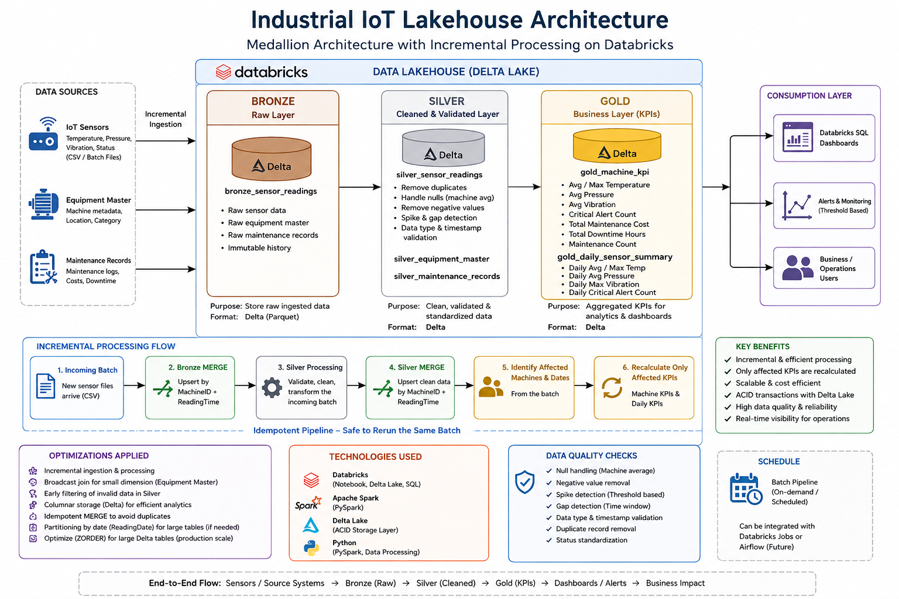

# Industrial IoT Databricks Lakehouse

End-to-end **Industrial IoT Data Engineering project** built using **Databricks, Apache Spark, PySpark, Delta Lake, Medallion Architecture, incremental processing, and Databricks AI/BI dashboards**.

The pipeline processes industrial sensor readings, equipment master data, and maintenance records through **Bronze, Silver, and Gold layers** and generates machine-health and maintenance KPIs for analytics.

---

## Architecture



### Data Flow

```text
Industrial IoT CSV Sources
          ↓
Databricks Unity Catalog Volume
          ↓
Bronze Layer
Raw Delta Tables
          ↓
Silver Layer
Cleaned & Validated Data
          ↓
Gold Layer
Business KPIs
          ↓
Databricks AI/BI Dashboard
```

---

## Technologies Used

- Databricks
- Apache Spark
- PySpark
- Delta Lake
- Python
- Databricks SQL
- Databricks AI/BI
- Unity Catalog Volumes
- GitHub

---

## Dataset

The project uses three main Industrial IoT datasets.

### Sensor Readings

Contains time-series machine sensor measurements such as:

- Machine ID
- Reading Time
- Temperature
- Pressure
- Flow
- Vibration

### Equipment Master

Contains information about industrial machines and equipment, including equipment and plant details.

### Maintenance Records

Contains maintenance-related information such as:

- Machine ID
- Maintenance Date
- Maintenance Cost
- Downtime Hours
- Maintenance Records

---

## Medallion Architecture

### Bronze Layer

The Bronze layer stores the raw ingested source data as Delta tables.

```text
bronze_sensor_readings
bronze_equipment_master
bronze_maintenance_records
```

Raw source data is preserved so that it remains available for:

- Reprocessing
- Troubleshooting
- Auditing
- Data-quality investigation

---

### Silver Layer

The Silver layer cleans, validates, and standardizes the Bronze data.

Main transformations include:

- Duplicate removal
- Timestamp conversion
- Null-value handling
- Machine-level average imputation for missing sensor values
- Removal of invalid negative sensor readings
- Temperature status classification
- Pressure status classification
- Overall machine status classification
- Equipment master validation
- Maintenance record validation

Silver tables:

```text
silver_sensor_readings
silver_equipment_master
silver_maintenance_records
```

---

## Gold Layer

The Gold layer creates aggregated, business-ready KPIs.

### Machine KPI Table

```text
gold_machine_kpi
```

Metrics include:

- Average Temperature
- Maximum Temperature
- Average Pressure
- Average Vibration
- Critical Alerts
- Total Maintenance Cost
- Total Downtime Hours
- Maintenance Count

### Daily Sensor Summary

```text
gold_daily_sensor_summary
```

Metrics include:

- Daily Average Temperature
- Daily Maximum Temperature
- Daily Average Pressure
- Daily Maximum Vibration
- Daily Critical Alert Count

---

## Incremental Processing

The project also demonstrates **incremental sensor-data processing using Delta MERGE**.

Instead of rebuilding the complete pipeline whenever new sensor data arrives, the incoming batch is processed and only the affected machines and dates are recalculated.

```text
Incoming Sensor Batch
        ↓
Bronze Delta MERGE
        ↓
Clean & Validate Sensor Data
        ↓
Silver Delta MERGE
        ↓
Identify Affected Machines / Dates
        ↓
Recalculate Affected KPIs
        ↓
Gold Delta MERGE
```

Using Delta `MERGE` provides upsert behavior and helps make the pipeline **idempotent**, meaning the same batch can be rerun without creating duplicate records.

---

## Performance Optimizations

The project includes practical Spark and Databricks optimization techniques:

- Incremental processing instead of rebuilding the complete pipeline
- Recalculation of only affected machine and date KPIs
- Broadcast join for the small Equipment Master dataset
- Early removal of invalid records before downstream aggregations
- Delta Lake storage
- MERGE-based upserts to prevent duplicate records

For larger production datasets, additional techniques such as partitioning and Delta table optimization can also be considered.

---

## Dashboard

Gold-layer KPIs are visualized using a **Databricks AI/BI Dashboard**.


The dashboard includes:

- Total Machines
- Total Critical Alerts
- Total Maintenance Cost
- Maintenance Cost by Machine
- Total Downtime by Machine
- Critical Alerts by Machine
- Daily Average Temperature Trend

---

## Repository Structure

```text
industrial-iot-databricks-lakehouse/
│
├── data/
│   ├── sensor_readings.csv
│   ├── equipment_master.csv
│   ├── maintenance_records.csv
│   └── data_dictionary.csv
│
├── images/
│   ├── architecture.png
│   └── dashboard.png
│
├── notebooks/
│   └── industrial_iot_lakehouse.ipynb
│
└── README.md
```

---

## How to Run

1. Create or open a Databricks workspace.
2. Upload the sample CSV files to a Unity Catalog Volume.
3. Update the Volume path in the notebook if required.
4. Run the Bronze ingestion cells.
5. Run the Silver cleaning and validation cells.
6. Run the Gold KPI transformation cells.
7. Run the incremental pipeline using the sample incoming batch.
8. Use the Gold tables to create the Databricks AI/BI dashboard.

---

## Key Concepts Demonstrated

- Medallion Architecture
- ETL Pipeline Design
- PySpark DataFrame Transformations
- Data Quality Validation
- Delta Lake
- Delta MERGE / Upsert
- Incremental Data Processing
- Idempotent Pipelines
- Spark Aggregations
- Broadcast Joins
- Industrial IoT Data Processing
- KPI Development
- Databricks Dashboarding

---

## Future Enhancements

Possible production extensions include:

- Databricks Workflows for scheduling and orchestration
- Auto Loader for scalable file ingestion
- Kafka or Structured Streaming for real-time sensor ingestion
- Data-quality quarantine tables
- Pipeline monitoring and alerting
- Additional Delta optimization for larger datasets

These are **future production enhancements** and are not implemented in the current project.

---

## Author

**Ramanan M**

Data Engineer | Industrial Data Engineering | PySpark | Databricks | GenAI
